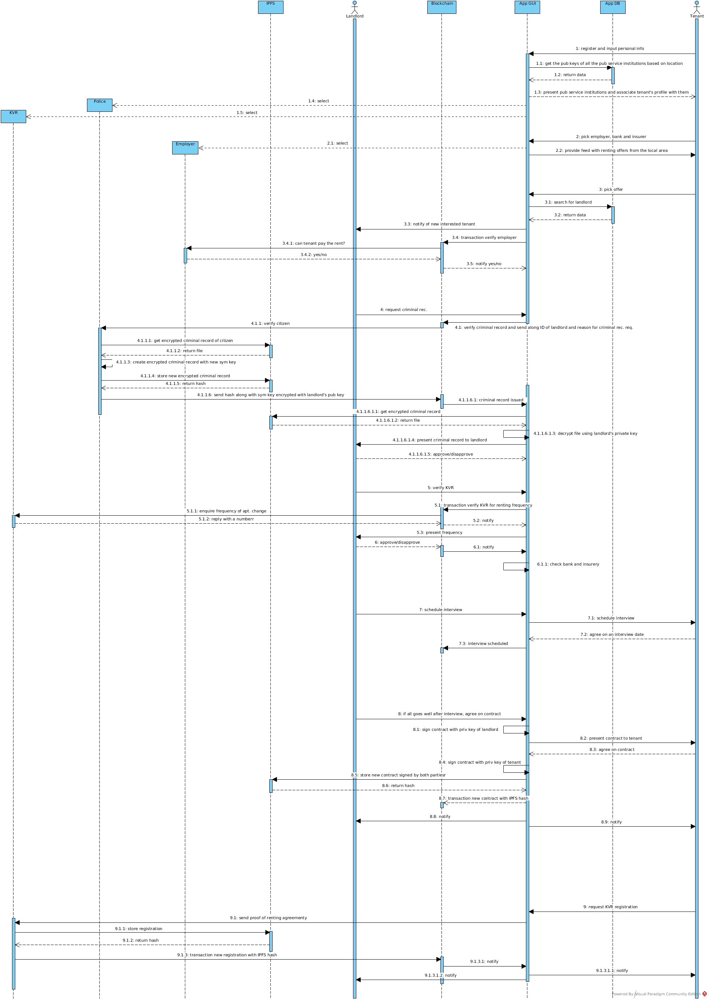

# Crypto Lodging

## Prerequisites
- Install yarn using following commands:

	First configure your repository
	```
	curl -sS https://dl.yarnpkg.com/debian/pubkey.gpg | sudo apt-key add -
	echo "deb https://dl.yarnpkg.com/debian/ stable main" | sudo tee /etc/apt/sources.list.d/yarn.list
	```
	Then install yarn using the following command:

	```
	sudo apt-get update && sudo apt-get install yarn -y
	```
	Ensure the following command has a similar output:
	```
	$ yarn -version
	1.9.2
	```
- Install node.js and npm using this [link](https://nodejs.org/en/download/package-manager/)
  	Ensure the following command has a similar output
  	```
	 $ npm -v
	 3.5.2
	```

## Steps to setup

- Install truffle - `sudo yarn global add truffle`
- Navigate to the project folder and run - `yarn` - this installs all the dependency modules
- Install Metamask for your browser using this [link](https://metamask.io/)
- Install Ganache-CLI, an ethereum blockchain test network, using `sudo npm install -g ganache-cli`

## Steps to Install IPFS

- Install Go programming language (atleast version 1.10). Refer to - [Installing Go](https://golang.org/doc/install)
- Setup Go profile [for linux] by adding the following lines to ~/.profile:
```
    export GOPATH=$HOME/go
    export PATH=$PATH:$GOROOT/bin:$GOPATH/bin
    cd $GOPATH/src
```
- Install IPFS (following are for linux)

```
    wget -O $HOME/go-ipfs.tar.gz "https://dist.ipfs.io/go-ipfs/v0.4.15/go-ipfs_v0.4.15_linux-amd64.tar.gz"
    mv ~/go-ipfs.tar.gz $GOPATH/src/
    cd go-ipfs  
    sudo ./install.sh
```
  For other environment, please use this [link](https://dist.ipfs.io/#go-ipfs)

- Install IPTB

```
    go get -u github.com/whyrusleeping/gx
    go get -u github.com/whyrusleeping/gx-go
    go get -u github.com/ipfs/go-ipfs
    sudo cp $GOPATH/bin/gx /usr/local/bin/
    sudo cp $GOPATH/bin/gx-go /usr/local/bin/
    cd $GOPATH/src/github.com/ipfs/go-ipfs
    gx install
    go get -u github.com/whyrusleeping/iptb
    cd $GOPATH/src/github.com/whyrusleeping/iptb
    gx install
    go install
    sudo cp $GOPATH/bin/iptb /usr/local/bin/
```

- To test successful installation, execute `iptb -v`. You should get an output similar to: `iptb version 0.0.0`

## Steps to setup local ipfs network:

Execute the following commands:

```
    ipfs init
    iptb init -n 1
    iptb shell 0
    ipfs config --json API.HTTPHeaders.Access-Control-Allow-Origin '["*"]'
    ipfs config --json API.HTTPHeaders.Access-Control-Allow-Credentials "[\"true\"]"
    ipfs config --json API.HTTPHeaders.Access-Control-Allow-Methods "[\"PUT\", \"POST\", \"GET\"]"
    ipfs config Addresses.API /ip4/127.0.0.1/tcp/4432
    ipfs daemon
```
Here we are configuring the Access control and port on which ipfs daemon would be running. This port would be used by our API to bind the ipfs daemon.

# Project structure

## Contracts: directory path [$PATH_TO_CODE/contracts/]
- Federation.sol - contains the code to configure federation addresses and to add trusted parties into the system. It also contains utility functions and modifiers for access control.
- ProofOfEmployment.sol - contains business logic for establishing communication channels among various entities. It also contains all the events that are exchanged via the dApp.

## IPFS:  directory path [$PATH_TO_CODE/src/components/Events/Events.js, $PATH_TO_CODE/src/components/UploadContract/UploadContract.js]
Contains the code to connect to ipfs daemon, upload the contract to ipfs, render it in the library (using pdfjs library) and extract it at the other end.

## BigchainDB: directory path [$PATH_TO_CODE/src/components/Events/Events.js]
contains the code to connect to bcdb testnet, configure the keys for HousingAuthorityNode and adding the rental contract data to the bcdb. This BCDB would be intended to be shared among various housing authorities(HA) of different cities so as to maintain a history of relocation for the Tenant as well as maintain a common repository of information shared among various HAs.

## UI Code: directory path [$PATH_TO_CODE/src/components/]
contains various React containers for different components of the UI. Each component is dependent on the role (access) of the user based on their accounts that are managed using the Identity provider - Metamask


# How to develop

1.  Have Ganache running: `ganache-cli -d -m "raven shock define wish brown cloth twin win weasel stable tone share"`
2.  In MetaMask click on top left and switch network to `Localhost 8545`.
3.  In MetaMask restore from seed pharase wih: raven shock define wish brown cloth twin win weasel stable tone share
4.  In a seperate console run `sh truffle_script.sh` to compile the smart contracts and migrate to test network
5.  To run the server, in a new console type `yarn run start`
6.  Go to **localhost:3000**
7.  You can make changes to frontend without doing all these steps again, just have ganache-cli and your server running (server may need to be restarted for certain changes)

# Ganache Available Accounts

(0) 0x4a927d1c6bc92a672b9fa81d898cafbc775ec8bf  
(1) 0x5764e7337dfae66f5ac5551ebb77307709fb0219  
(2) 0x11c2e86ebecf701c265f6d19036ec90d277dd2b3  
(3) 0xc33a1d62e6de00d4c9b135718280411101bcb9dd  
(4) 0x01edfe893343e51f89b323c702e21868109bbf1f  
(5) 0x298bd2bd1aab49b7a8bb0943ab972bd53b084f09  
(6) 0x95057ead904141f497cdbad7714b295e12f8c48a  
(7) 0xf11e2da93e64f102016b44bab37d1166a497cf8a  
(8) 0x9956e0c61ba9051595316edf19dd5e699ca0fa91  
(9) 0xec6b9b45b15289c572a6cbbf572d5e4e5bd30c97

# Ganache Private Keys

(0) 370f78607c70c14732fddff31791ed44bdd1511e552d96b68c9d158a28dd2f0a  
(1) 620b40dbe275c49b530e71bb6c73cae74c4a350726a9eea3731796a448414d6e  
(2) 822d47ac8fe1eecb3e223f6cb2d99301bbfe4bbde5ab132599a1d55a68277d71  
(3) 0fa41039b5b4b807c0443b42a33b82106d0c3ed995adf674983393125b1a4b0a  
(4) 6284213496f09d17e3838513a166f44d82eae84819f10d770964d82186c88835  
(5) 7d9401f9ab930f3c61268d4fa709d1fa04983402151e2dbfcc8269962ead2f27  
(6) ea8f33ab18e251c924cc17f3210fa1e49d4ef51379aed78026d5bd46d93eaff4  
(7) 98b2bf25a3dccdfe9adce99b9ae3ff56f86b52159122f2a87ae2ed754380a432  
(8) 523b96e31e46d286d5e6ca33e286b1954afa51aceb2676a8332319bf25c3044f  
(9) e1d01b5ca41fb1281eff203f151b9b769dcf7eb2304fc55505fdf0c55d368367

# Steps to interact with the UI
For details please refer to [Event Flow](https://drive.google.com/open?id=1AOyHZg6u-CiPfXI0c3LE_v66PsSSV262)  
Please refresh webpage whenever you switch account in MetaMask


# Diagrams

#### Sequence Diagram



